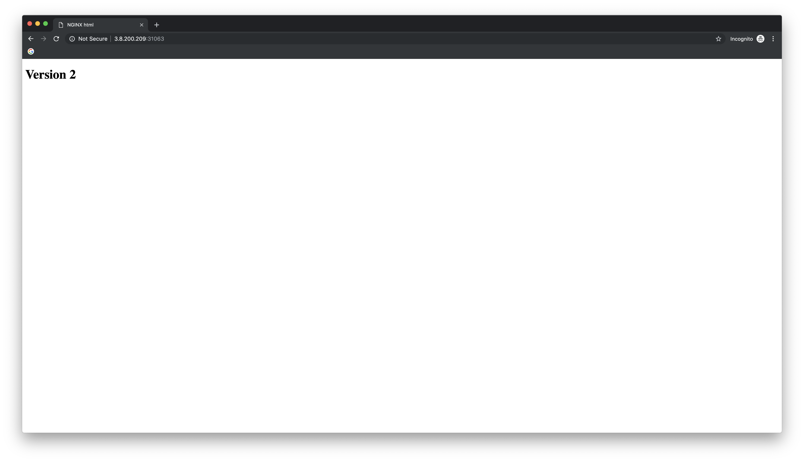

# Kubernetes Blue/Green Lab - GKE
## Blue-Green Deployment
In this lab you will create two deployments and then using a service update the label to 'cut over' from blue deployment to green. 

### Step 1: Create Service
This service will target containers with labels "blue" and type "webserver" 
*service.yaml*
```yaml
apiVersion: v1
kind: Service
metadata:
  name: webserver
spec:
  type: LoadBalancer
  ports:
  - port: 80
    targetPort: 80
    protocol: TCP
  selector:
    type: webserver
    color: blue
```

Create the new service from the above `yaml` file. 
```bash
kubectl apply -f service.yaml 
```

Get the `external IP` of the service 
```bash
kubectl get svc webserver 
```

You should see something like this: 
```
NAME        TYPE           CLUSTER-IP   EXTERNAL-IP       PORT(S)        AGE
webserver   LoadBalancer   10.0.0.66    104.198.250.195   80:32195/TCP   4m8s
```

### Step 2: Launch 'Blue' deployment 
Launch three pods running `v1` of our software.  This version will have `color=blue` label. 

*blue.yaml*
```yaml
apiVersion: extensions/v1beta1
kind: Deployment
metadata:
  name: webserver-blue
spec:
  replicas: 3
  template:
    metadata:
      labels:
        type: webserver
        color: blue
    spec:
      containers:
      - image: hanzel/nginx-html:1
        name: webserver-container
        ports:
        - containerPort: 80
          name: http-server
```

Create the 'Blue' deployment
```bash
kubectl apply -f blue.yaml
```

Confirm the pods started and are in a `Running` state: 
```bash
kubectl get pods 
```

Output: 
```bash
NAME                               READY   STATUS    RESTARTS   AGE
webserver-blue-7555844597-krp88    1/1     Running   0          9m44s
webserver-blue-7555844597-lmd6c    1/1     Running   0          9m44s
webserver-blue-7555844597-rmndl    1/1     Running   0          9m44s
```

Now load the http://$EXTERNAL_IP in a browser and you should see `v1` of the application. 


Great!  Now let's say you wanted to release a new version of your application. 

To do that you just need to create a new deployment file. 
*green.yaml*
```yaml
apiVersion: extensions/v1beta1
kind: Deployment
metadata:
  name: webserver-green
spec:
  replicas: 3
  template:
    metadata:
      labels:
        type: webserver
        color: green
    spec:
      containers:
      - image: hanzel/nginx-html:2
        name: webserver-container
        ports:
        - containerPort: 80
          name: http-server
```

If you look at the above file you'll notice that almost everything is the same, the only differences are: 
```yaml
name: webserver-green
color: green
image: nginx-html:2
```

Now deploy `v2` of the application. 
```bash
kubectl apply -f green.yaml
```

Confirm both `blue` and `green` deployments are running. 
```bash
kubectl get pods 
```

Output: 
```
NAME                               READY   STATUS    RESTARTS   AGE
webserver-blue-7555844597-krp88    1/1     Running   0          13m
webserver-blue-7555844597-lmd6c    1/1     Running   0          13m
webserver-blue-7555844597-rmndl    1/1     Running   0          13m
webserver-green-847d984dd9-4ppjk   1/1     Running   0          13m
webserver-green-847d984dd9-m5lsn   1/1     Running   0          13m
webserver-green-847d984dd9-pmvpr   1/1     Running   0          13m
```

Now let's make sure the labels are correct: 
```bash
kubectl get pods --show-labels 
```

Output: 
```
NAME                               READY   STATUS    RESTARTS   AGE   LABELS
webserver-blue-7555844597-krp88    1/1     Running   0          14m   color=blue,pod-template-hash=7555844597,type=webserver
webserver-blue-7555844597-lmd6c    1/1     Running   0          14m   color=blue,pod-template-hash=7555844597,type=webserver
webserver-blue-7555844597-rmndl    1/1     Running   0          14m   color=blue,pod-template-hash=7555844597,type=webserver
webserver-green-847d984dd9-4ppjk   1/1     Running   0          14m   color=green,pod-template-hash=847d984dd9,type=webserver
webserver-green-847d984dd9-m5lsn   1/1     Running   0          14m   color=green,pod-template-hash=847d984dd9,type=webserver
webserver-green-847d984dd9-pmvpr   1/1     Running   0          14m   color=green,pod-template-hash=847d984dd9,type=webserver
```

Great! Now we can see that `v1` of our app has label `color=blue` and `v2` has label `color=green` 

### Update service
Update the `service.yaml` file so that it directs traffic to our `v2` blue deployment by changing the label to `color: green`

Now reload the page in your browser and you should see: 



If you do not see it update, open a private browser window and try to load the site in that, or clear the cache on your browser and reload the page. 

In this lab you created 2 deployment files and a service file.  You deployed `v1` with label `color=blue` and configured the `webserver` service to send traffic to pods that had label `color=blue`.  

After this you deployed an updated version of your app `v2` and then updated the service selector label to point to the new deployment with label `color=green` 

This was a successful blue-green cutover! 

## Lab Complete.