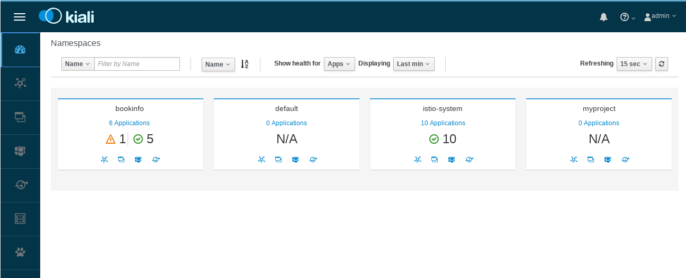
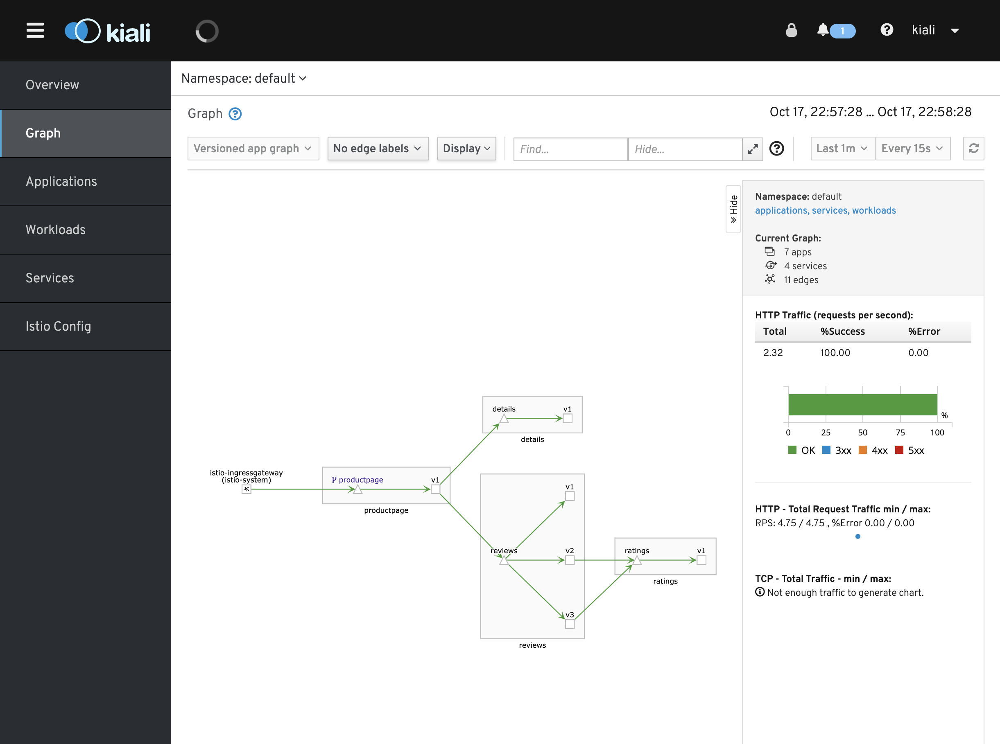
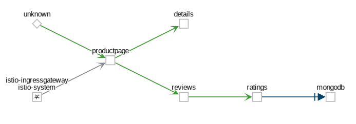
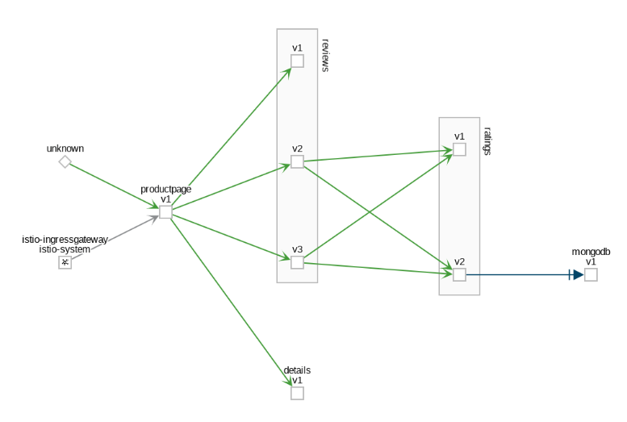
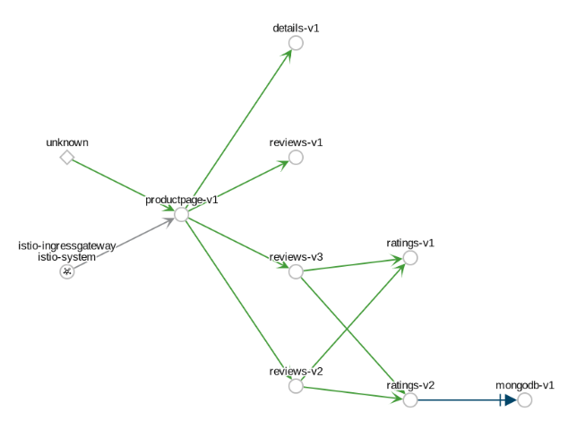
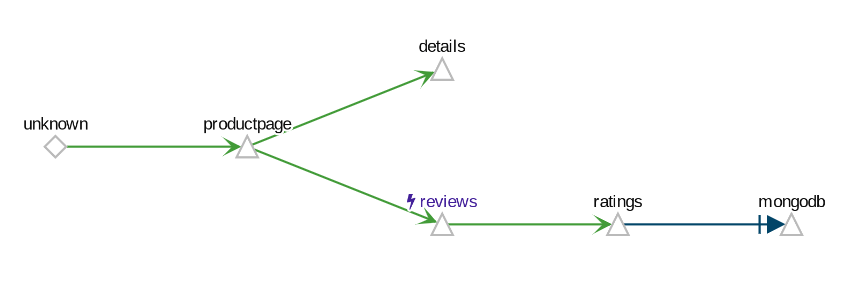
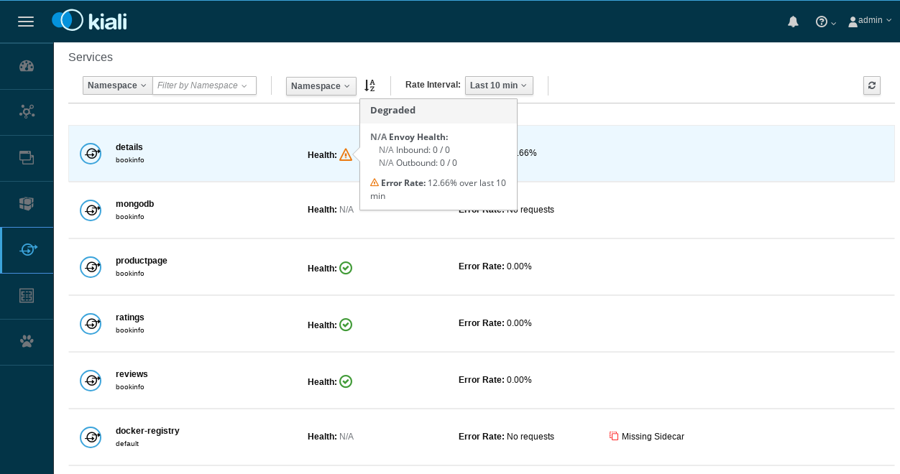
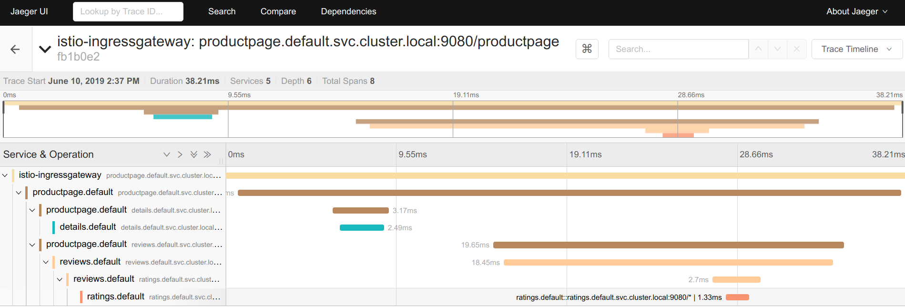
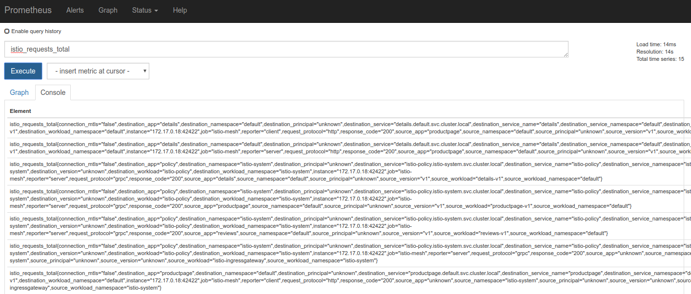

# Istio Service Management
Estimated duration: 2-4 hours


## Summary 
In this lab, you will learn how to install and configure Istio, an open source framework for connecting, securing, and managing microservices, on Kubernetes. You will also deploy an Istio-enabled multi-service application. Once you complete this lab, you can try managing APIs with Istio and Apigee Edge.

# Table of Contents
1. [Introduction](#introduction)
2. [Installing Istio](#installing-istio)
3. [Verifying the installation](#verifying-the-installation)
4. [Deploying an application](#deploying-an-application)
5. [Use the application](#use-the-application)
6. [Dynamically change request routing](#dynamically-change-request-routing)
7. [Fault Injection](#fault-injection)
8. [Circuit Breaker](#circuit)
9. [Security](#security)
    - [Testing Istio mutual TLS authentication](#mutual)
    - [Testing Istio RBAC](#rbac)
    - [Testing Istio JWT Policy](#jwt)
10. [Monitoring and Observability](#monitoring)
   - [View metrics and tracing](#viewing-metrics-and-tracing)
   - [Monitoring for Istio](#monitoring-for-istio)
   - [Generating a Service Graph](#generate-graph)

## Introduction <a name="introduction"/>

[Istio](http://istio.io) is an open source framework for connecting, securing, and managing microservices, including services running Kubernetes. It lets you create a network of deployed services with load balancing, service-to-service authentication, monitoring, and more, without requiring any changes in service code.

You add Istio support to services by deploying a special Envoy sidecar proxy to each of your application&#39;s pods in your environment that intercepts all network communication between microservices, configured and managed using Istio's control plane functionality.

## Installing Istio <a name="installing-istio"/>

Now, let&#39;s install Istio. Istio is installed in its own Kubernetes istio-system namespace, and can manage microservices from all other namespaces. The installation includes Istio core components, tools, and samples.

The [Istio release page](https://github.com/istio/istio/releases) offers download artifacts for several OSs. In our case we&#39;ll be using this command to download and extract the latest release automatically:

```curl -L https://git.io/getLatestIstio | sh -```

The installation directory contains the following:

- Installation .yaml files for Kubernetes in **install/**
- Sample applications in **samples/**
- The istioctl client binary in the **bin/** directory. This tool is used when manually injecting Envoy as a sidecar proxy and for creating routing rules and policies.
- The VERSION configuration file

Change to the istio install directory:

```cd ./istio-* ```

Add the istioctl client to your PATH:

```export PATH=$PWD/bin:$PATH```

Let&#39;s now install Istio&#39;s core components. We will install the Istio Auth components which enable [**mutual TLS authentication**](https://istio.io/docs/concepts/security/mutual-tls.html) between sidecars:


We need to setup authentication credentials for Kiali (monitoring) 

Set environment variables for username and password:
```
KIALI_USERNAME=$(read -p 'Kiali Username: ' uval && echo -n $uval | base64)
KIALI_PASSPHRASE=$(read -sp 'Kiali Passphrase: ' pval && echo -n $pval | base64)
```

Create the `istio-system` namespace 
```
NAMESPACE=istio-system
kubectl create namespace $NAMESPACE
```

Create the secret for storing the username/password set above. 
```
cat <<EOF | kubectl apply -f -
apiVersion: v1
kind: Secret
metadata:
  name: kiali
  namespace: $NAMESPACE
  labels:
    app: kiali
type: Opaque
data:
  username: $KIALI_USERNAME
  passphrase: $KIALI_PASSPHRASE
EOF
```


In Istio 1.0+ the recommeded installation tool is Helm. The following steps walk through installation of the Helm client, and using Helm to install Istio. 


## Install Helm 

```
wget https://raw.githubusercontent.com/helm/helm/master/scripts/get -O - | bash
```

Now that Helm is installed we need to install the backend 

Create tiller service account
```
kubectl create serviceaccount tiller --namespace kube-system
```

Grant tiller cluster admin role 
```
kubectl create clusterrolebinding tiller-admin-binding --clusterrole=cluster-admin --serviceaccount=kube-system:tiller
```

Initialize Helm to install tiller in your cluster 
```
helm init --service-account=tiller
helm repo update
```

Install Istio CRDs
```
helm install install/kubernetes/helm/istio-init --name istio-init --namespace istio-system
```

Finally we can install Istio 

```
helm install install/kubernetes/helm/istio \
    --name istio \
    --namespace istio-system \
    --set global.mtls.enabled=true \
    --set kiali.enabled=true \
    --set grafana.enabled=true \
    --set servicegraph.enabled=true \
    --set "kiali.dashboard.jaegerURL=http://jaeger-query:16686" \
    --set "kiali.dashboard.grafanaURL=http://grafana:3000" 
```

This command will appear to hang for a couple minutes, but it is actually installing everything in the background. Once the installation is complete you will see output showing all of the components installed. 


This creates the istio-system namespace along with the required RBAC permissions, and deploys Istio-Pilot, Istio-Mixer, Istio-Ingress, Istio-Egress, and Istio-CA (Certificate Authority).

## Verifying the installation <a name="verifying-the-installation"/>

First, ensure the following Kubernetes services are deployed: istio-pilot, istio-mixer, istio-ingress, and istio-egress.

Run the command:
```
kubectl get svc -n istio-system
```
OUTPUT:

```
NAME            CLUSTER-IP      EXTERNAL-IP       PORT(S)                       AGE
grafana                    ClusterIP      10.35.242.92    <none>           3000/TCP                                                              8d
istio-citadel              ClusterIP      10.35.253.85    <none>           8060/TCP,9093/TCP                                                     8d
istio-egressgateway        ClusterIP      10.35.255.153   <none>           80/TCP,443/TCP                                                        8d
istio-ingressgateway       LoadBalancer   10.35.240.252   localhost        80:31380/TCP,443:31390/TCP,31400:31400/TCP                            8d
istio-pilot                ClusterIP      10.35.244.241   <none>           15003/TCP,15005/TCP,15007/TCP,15010/TCP,15011/TCP,8080/TCP,9093/TCP   8d
istio-policy               ClusterIP      10.35.245.176   <none>           9091/TCP,15004/TCP,9093/TCP                                           8d
istio-sidecar-injector     ClusterIP      10.35.245.49    <none>           443/TCP                                                               8d
istio-statsd-prom-bridge   ClusterIP      10.35.254.183   <none>           9102/TCP,9125/UDP                                                     8d
istio-telemetry            ClusterIP      10.35.247.113   <none>           9091/TCP,15004/TCP,9093/TCP,42422/TCP                                 8d
prometheus                 ClusterIP      10.35.246.22    <none>           9090/TCP                                                              8d
servicegraph               ClusterIP      10.35.253.226   <none>           8088/TCP                                                              8d
tracing                    LoadBalancer   10.35.254.155   localhost        80:30040/TCP                                                          8d
zipkin                     ClusterIP      10.35.243.89    <none>           9411/TCP                                                              8d
```

Then make sure that the corresponding Kubernetes pods are deployed and all containers are up and running.

Run the command:
```
kubectl get pods -n istio-system
```
OUTPUT:
```
NAME                                       READY     STATUS      RESTARTS   AGE
grafana-6f6dff9986-qhdwb                   1/1       Running     0          1d
istio-citadel-7bdc7775c7-b96t8             1/1       Running     0          1d
istio-cleanup-old-ca-6fj2q                 0/1       Completed   0          1d
istio-egressgateway-78dd788b6d-xsmkw       1/1       Running     1          1d
istio-ingressgateway-7dd84b68d6-v2fkj      1/1       Running     1          1d
istio-mixer-post-install-8tskw             0/1       Completed   0          1d
istio-pilot-d5bbc5c59-srqt7                2/2       Running     0          1d
istio-policy-64595c6fff-9xztj              2/2       Running     0          1d
istio-sidecar-injector-645c89bc64-hcgq9    1/1       Running     0          1d
istio-statsd-prom-bridge-949999c4c-lflmx   1/1       Running     0          1d
istio-telemetry-cfb674b6c-zb2xk            2/2       Running     0          1d
istio-tracing-754cdfd695-qq6jc             1/1       Running     0          1d
prometheus-86cb6dd77c-fhglv                1/1       Running     0          1d
servicegraph-5849b7d696-7dk7q              1/1       Running     0          1d
```

When all the pods are running, you can proceed.

## Deploying an application <a name="deploying-an-application"/>

Now Istio is installed and verified, you can deploy one of the sample applications provided with the installation — [BookInfo](https://istio.io/docs/guides/bookinfo.html). This is a simple mock bookstore application made up of four services that provide a web product page, book details, reviews (with several versions of the review service), and ratings - all managed using Istio.

You will find the source code and all the other files used in this example in your Istio [samples/bookinfo](https://github.com/istio/istio/tree/master/samples/bookinfo) directory. These steps will deploy the BookInfo application&#39;s services in an Istio-enabled environment, with Envoy sidecar proxies injected alongside each service to provide Istio functionality.

### Overview
In this guide we will deploy a simple application that displays information about a book, similar to a single catalog entry of an online book store. Displayed on the page is a description of the book, book details (ISBN, number of pages, and so on), and a few book reviews.

The BookInfo application is broken into four separate microservices:

* productpage. The productpage microservice calls the details and reviews microservices to populate the page.
* details. The details microservice contains book information.
* reviews. The reviews microservice contains book reviews. It also calls the ratings microservice.
* ratings. The ratings microservice contains book ranking information that accompanies a book review.

There are 3 versions of the reviews microservice:

* Version v1 doesn’t call the ratings service.
* Version v2 calls the ratings service, and displays each rating as 1 to 5 black stars.
* Version v3 calls the ratings service, and displays each rating as 1 to 5 red stars.

The end-to-end architecture of the application is shown below.


### Deploy Bookinfo

We deploy our application directly using `kubectl create` and its regular YAML deployment file. We will inject Envoy containers into the application pods using istioctl:

```kubectl create -f <(istioctl kube-inject -f samples/bookinfo/platform/kube/bookinfo.yaml)```

Finally, confirm that the application has been deployed correctly by running the following commands:

Run the command:
```
kubectl get services
```
OUTPUT:
```
NAME                       CLUSTER-IP   EXTERNAL-IP   PORT(S)              AGE
details       ClusterIP   10.35.240.243   <none>        9080/TCP   14s
kubernetes    ClusterIP   10.35.240.1     <none>        443/TCP    14d
productpage   ClusterIP   10.35.255.218   <none>        9080/TCP   14s
ratings       ClusterIP   10.35.244.227   <none>        9080/TCP   14s
reviews       ClusterIP   10.35.252.163   <none>        9080/TCP   14s
```

Run the command:
```
kubectl get pods
```

OUTPUT:
```
NAME                                        READY     STATUS    RESTARTS   AGE
details-v1-568f787b57-ml486       2/2       Running   0          36s
productpage-v1-74cc57988f-28nxg   2/2       Running   0          36s
ratings-v1-5bb4b7c645-8xbp8       2/2       Running   0          36s
reviews-v1-5b95b546f7-cdlww       2/2       Running   0          36s
reviews-v2-5799c54cb5-ffjv4       2/2       Running   0          36s
reviews-v3-5df5bd8dfc-9ldnx       2/2       Running   0          36s
```

With Envoy sidecars injected along side each service, the architecture will look like this:


Now that the Bookinfo services are up and running, you need to make the application accessible from outside of your Kubernetes cluster, e.g., from a browser. An Istio Gateway is used for this purpose.

Define the ingress gateway for the application:
```
kubectl apply -f samples/bookinfo/networking/bookinfo-gateway.yaml
```

Confirm the gateway has been created:
```
kubectl get gateway
```

output:
```
NAME               AGE
bookinfo-gateway   32s
```

## Use the application <a name="use-the-application"/>

Now that it&#39;s deployed, let&#39;s see the BookInfo application in action.


If running on Google Kubernetes Engine run the following to determine ingress IP and port:

```
kubectl -n istio-system get service istio-ingressgateway -o jsonpath='{.status.loadBalancer.ingress[0].ip}' 
```

OUTPUT:
```
35.xxx.xxx.xxx
```

Based on this information (Address), set the GATEWAY_URL environment variable:

`export GATEWAY_URL=$(kubectl -n istio-system get service istio-ingressgateway -o jsonpath='{.status.loadBalancer.ingress[0].ip}')`


If running on `localhost` set the `GATEWAY_URL` with the following:

```export GATEWAY_URL=localhost:80```


Check that the BookInfo app is running with curl:

Run the command:
```
curl -o /dev/null -s -w "%{http_code}\n" http://${GATEWAY_URL}/productpage
```
OUTPUT:
```
200
```

Then point your browser to _**http://$GATEWAY\_URL/productpage**_ to view the BookInfo web page. If you refresh the page several times, you should see different versions of reviews shown in the product page, presented in a round robin style (red stars, black stars, no stars), since we haven&#39;t yet used Istio to control the version routing


## Dynamically change request routing <a name="dynamically-change-request-routing"/>

The BookInfo sample deploys three versions of the reviews microservice. When you accessed the application several times, you will have noticed that the output sometimes contains star ratings and sometimes it does not. This is because without an explicit default version set, Istio will route requests to all available versions of a service in a random fashion.

We can use the istioctl command line tool to control routing, adding a route rule that says all traffic should go to the v1 service. First, confirm there are no route rules installed :

```istioctl get destinationrules -n default```

**NOTE: The `get` argument is deprecated and is it recommended to use `kubectl`**

```
kubectl get destinationrules -o yaml
```

No Resouces will be found. Now, create the rule(check out the source yaml files if you&#39;d like to understand how rules are specified) :

Run the commands:

```
kubectl apply -f samples/bookinfo/networking/virtual-service-all-v1.yaml -n default
```

```
kubectl apply -f samples/bookinfo/networking/destination-rule-all-mtls.yaml -n default
```
OUTPUT:
```
virtualservice "productpage" created
virtualservice "reviews" created
virtualservice "ratings" created
virtualservice "details" created
destinationrule "productpage" created
destinationrule "reviews" created
destinationrule "ratings" created
destinationrule "details" created
```

Look at the rule you&#39;ve just created:

```
kubectl get destinationrules -o yaml
```

Go back to the Bookinfo application (http://$GATEWAY\_URL/productpage) in your browser. You should see the BookInfo application productpage displayed. Notice that the productpage is displayed with no rating stars since reviews:v1 does not access the ratings service.

To test reviews:v2, but only for a certain user, let&#39;s create this rule:

```
kubectl apply -f samples/bookinfo/networking/virtual-service-reviews-test-v2.yaml -n default
```

Check out the route-rule-reviews-test-v2.yaml file to see how this virtual service is specified :

```
$ cat samples/bookinfo/networking/virtual-service-reviews-test-v2.yaml
```
OUTPUT:
```
apiVersion: networking.istio.io/v1alpha3
kind: VirtualService
metadata:
  name: reviews
spec:
  hosts:
    - reviews
  http:
  - match:
    - headers:
        end-user:
          exact: jason
    route:
    - destination:
        host: reviews
        subset: v2
  - route:
    - destination:
        host: reviews
        subset: v1
```

Look at the virtual service you&#39;ve just created :

```kubectl get virtualservices reviews -o yaml```

We now have a way to route some requests to use the reviews:v2 service. Can you guess how? (Hint: no passwords are needed) See how the page behavior changes if you are logged in as no-one and &#39;jason&#39;.

You can read the [documentation page](https://istio.io/docs/tasks/traffic-management/request-routing.html) for further details on Istio&#39;s request routing.

Once the v2 version has been tested to our satisfaction, we can use Istio to send traffic from all users to v2, optionally in a gradual fashion.

Now send 80% to v1 and 20% to v2. 
```
kubectl apply -f samples/bookinfo/networking/virtual-service-reviews-80-20.yaml
```
To confirm you can go refresh the page in your browser and determine that majority of the time you are hitting v1, but then about 20% of the time you hit v2.

In this task you migrated traffic from an old to new version of the reviews service using Istio’s weighted routing feature. Note that this is very different than doing version migration using the deployment features of container orchestration platforms, which use instance scaling to manage the traffic.

With Istio, you can allow the two versions of the reviews service to scale up and down independently, without affecting the traffic distribution between them.

Now let's cleanup our routing rules.

```
kubectl delete --ignore-not-found=true -f samples/bookinfo/networking/virtual-service-all-v1.yaml -n default
```

## Traffic mirroring (shadow traffic) 

A deployment brings new code to production but it takes no production traffic. Once in the production environment, service teams are free to run smoke tests, integration tests, etc without impacting any users. A service team should feel free to deploy as frequently as it wishes.

A release brings live traffic to a deployment but may require signoff from “the business stakeholders”. Ideally, bringing traffic to a deployment can be done in a controlled manner to reduce risk. For example, we may want to bring internal-user traffic to the deployment first. Or we may want to bring a small fraction, say 1%, of traffic to the deployment. If any of these release rollout strategies (internal, non-paying, 1% traffic, etc) exhibit undesirable behavior (thus the need for strong observability) then we can rollback.

### Dark traffic 
One strategy we can use to reduce risk for our releases, before we even expose to any type of user, is to shadow live traffic to our deployment. With traffic shadowing, we can take a fraction of traffic and route it to our new deployment and observe how it behaves. We can do things like test for errors, exceptions, performance, and result parity. 
With Istio, we can do this kind of traffic control by mirroring traffic from one service to another. Let’s take a look at an example.

In this task, you will first force all traffic to v1 of a test service. Then, you will apply a rule to mirror a portion of traffic to v2.

Start by deploying two versions of the httpbin service that have access logging enabled:

**httpbin-v1**:
```
cat <<EOF | istioctl kube-inject -f - | kubectl create -f -
apiVersion: extensions/v1beta1
kind: Deployment
metadata:
  name: httpbin-v1
spec:
  replicas: 1
  template:
    metadata:
      labels:
        app: httpbin
        version: v1
    spec:
      containers:
      - image: docker.io/kennethreitz/httpbin
        imagePullPolicy: IfNotPresent
        name: httpbin
        command: ["gunicorn", "--access-logfile", "-", "-b", "0.0.0.0:8080", "httpbin:app"]
        ports:
        - containerPort: 8080
EOF
```

**httpbin-v2**:
```
cat <<EOF | istioctl kube-inject -f - | kubectl create -f -
apiVersion: extensions/v1beta1
kind: Deployment
metadata:
  name: httpbin-v2
spec:
  replicas: 1
  template:
    metadata:
      labels:
        app: httpbin
        version: v2
    spec:
      containers:
      - image: docker.io/kennethreitz/httpbin
        imagePullPolicy: IfNotPresent
        name: httpbin
        command: ["gunicorn", "--access-logfile", "-", "-b", "0.0.0.0:8080", "httpbin:app"]
        ports:
        - containerPort: 8080
EOF
```

Now create a Kubernetes service: 
```
cat <<EOF | kubectl create -f -
apiVersion: v1
kind: Service
metadata:
  name: httpbin
  labels:
    app: httpbin
spec:
  ports:
  - name: http
    port: 8080
  selector:
    app: httpbin
EOF
```

Start up the sleep service so you can run curl to provide load: 
```
cat <<EOF | istioctl kube-inject -f - | kubectl create -f -
apiVersion: extensions/v1beta1
kind: Deployment
metadata:
  name: sleep
spec:
  replicas: 1
  template:
    metadata:
      labels:
        app: sleep
    spec:
      containers:
      - name: sleep
        image: tutum/curl
        command: ["/bin/sleep","infinity"]
        imagePullPolicy: IfNotPresent
EOF
```

By default Kubernetes load balances across both versions of the httpbin service. In this step, you will change that behavior so that all traffic goes to v1.

Create a default route rule to route all traffic to v1 of the service:

```
cat <<EOF | kubectl apply -f -
apiVersion: networking.istio.io/v1alpha3
kind: VirtualService
metadata:
  name: httpbin
spec:
  hosts:
    - httpbin
  http:
  - route:
    - destination:
        host: httpbin
        subset: v1
      weight: 100
---
apiVersion: networking.istio.io/v1alpha3
kind: DestinationRule
metadata:
  name: httpbin
spec:
  host: httpbin
  trafficPolicy:
    tls:
      mode: ISTIO_MUTUAL
  subsets:
  - name: v1
    labels:
      version: v1
  - name: v2
    labels:
      version: v2
EOF
```
Now all traffic goes to the httpbin v1 service.

**NOTE:** GCP cloud shell is in the process of updating from Python 2 to Python 3. To avoid errors please run the following
```
mkdir -p ~/.cloudshell && touch ~/.cloudshell/no-python-warning
```

Send some traffic to the service:
```
export SLEEP_POD=$(kubectl get pod -l app=sleep -o jsonpath={.items..metadata.name})
kubectl exec -it $SLEEP_POD -c sleep -- sh -c 'curl  http://httpbin:8080/headers' | python -m json.tool
```

Output should be similar to: 
```
{
  "headers": {
    "Accept": "*/*",
    "Content-Length": "0",
    "Host": "httpbin:8080",
    "User-Agent": "curl/7.35.0",
    "X-B3-Sampled": "1",
    "X-B3-Spanid": "eca3d7ed8f2e6a0a",
    "X-B3-Traceid": "eca3d7ed8f2e6a0a",
    "X-Ot-Span-Context": "eca3d7ed8f2e6a0a;eca3d7ed8f2e6a0a;0000000000000000"
  }
}
```

Check the logs for each version: 
V1: 
```
export V1_POD=$(kubectl get pod -l app=httpbin,version=v1 -o jsonpath={.items..metadata.name})
kubectl logs $V1_POD -c httpbin
```

Output: 
```
127.0.0.1 - - [12/Mar/2019:03:27:56 +0000] "GET /headers HTTP/1.1" 200 241 "-" "curl/7.35.0"
```

V2: 
```
export V2_POD=$(kubectl get pod -l app=httpbin,version=v2 -o jsonpath={.items..metadata.name})
kubectl logs $V2_POD -c httpbin
```

Output: 
```
<none>
```

Mirroring traffic to v2  
Change the route rule to mirror traffic to v2:
```
cat <<EOF | kubectl apply -f -
apiVersion: networking.istio.io/v1alpha3
kind: VirtualService
metadata:
  name: httpbin
spec:
  hosts:
    - httpbin
  http:
  - route:
    - destination:
        host: httpbin
        subset: v1
      weight: 100
    mirror:
      host: httpbin
      subset: v2
EOF
```
This route rule sends 100% of the traffic to v1. The last section specifies to mirror to the httpbin-v2 service. When traffic gets mirrored, the requests are sent to the mirrored service with their Host/Authority headers appended with -shadow. For example, cluster-1 becomes cluster-1-shadow.

Also, it is important to note that these requests are mirrored as “fire and forget”, which means that the responses are discarded.

Send in traffic:
```
kubectl exec -it $SLEEP_POD -c sleep -- sh -c 'curl  http://httpbin:8080/headers' | python -m json.tool
```

Now, you should see access logging for both v1 and v2. The access logs created in v2 are the mirrored requests that are actually going to v1.

```
kubectl logs $V1_POD -c httpbin
```

Output
```
127.0.0.1 - - [12/Mar/2019:03:27:56 +0000] "GET /headers HTTP/1.1" 200 241 "-" "curl/7.35.0"
127.0.0.1 - - [12/Mar/2019:03:31:42 +0000] "GET /headers HTTP/1.1" 200 241 "-" "curl/7.35.0"
```

```
kubectl logs $V2_POD -c httpbin
```

Output:
```
127.0.0.1 - - [12/Mar/2019:03:31:42 +0000] "GET /headers HTTP/1.1" 200 281 "-" "curl/7.35.0"
```

The above task configured Istio to mirror all traffic sent to `httpbin-v1` to `httpbin-v2` so that we can confirm it responds as expected.  Once we have confirmed it is handling connections correctly we can direct all traffic to v2. 


Now let's cleanup: 
```
kubectl delete --ignore-not-found=true -f samples/bookinfo/networking/destination-rule-all-mtls.yaml
kubectl delete --ignore-not-found=true virtualservice httpbin
kubectl delete --ignore-not-found=true destinationrule httpbin
```

Shutdown the httpbin service and client 
```
kubectl delete --ignore-not-found=true deploy httpbin-v1 httpbin-v2 sleep
kubectl delete --ignore-not-found=true svc httpbin
```

## Fault Injection <a name="fault-injection"/>

### Fault Injection using HTTP Delay
This task shows how to inject delays and test the resiliency of your application.

*_Note: This assumes you don’t have any routes set yet. If you’ve already created conflicting route rules for the sample, you’ll need to use replace rather than create in one or both of the following commands._*

To test our BookInfo application microservices for resiliency, we will inject a 7s delay between the reviews:v2 and ratings microservices, for user “jason”. Since the reviews:v2 service has a 10s timeout for its calls to the ratings service, we expect the end-to-end flow to continue without any errors.

Create a fault injection rule to delay traffic coming from user “jason” (our test user)

```
kubectl apply -f samples/bookinfo/networking/destination-rule-all-mtls.yaml
kubectl apply -f samples/bookinfo/networking/virtual-service-reviews-test-v2.yaml
```

Run the command:
```
kubectl apply -f samples/bookinfo/networking/virtual-service-ratings-test-delay.yaml
```
You should see confirmation the routing rule was created. Allow several seconds to account for rule propagation delay to all pods.

#### Observe application behavior

Log in as user “jason”. If the application’s front page was set to correctly handle delays, we expect it to load within approximately 7 seconds. To see the web page response times, open the Developer Tools menu in IE, Chrome or Firefox (typically, key combination _Ctrl+Shift+I or Alt+Cmd+I_), tab Network, and reload the _productpage_ web page.

You will see that the webpage loads in about 6 seconds. The reviews section will show _Sorry, product reviews are currently unavailable for this book_.

#### Understanding what happened
The reason that the entire reviews service has failed is because our BookInfo application has a bug. The timeout between the productpage and reviews service is less (3s + 1 retry = 6s total) than the timeout between the reviews and ratings service (10s). These kinds of bugs can occur in typical enterprise applications where different teams develop different microservices independently. Istio’s fault injection rules help you identify such anomalies without impacting end users.

**Notice that we are restricting the failure impact to user “jason” only. If you login as any other user, you would not experience any delays**

### Fault Injection using HTTP Abort
As another test of resiliency, we will introduce an HTTP abort to the ratings microservices for the user “jason”. We expect the page to load immediately unlike the delay example and display the “product ratings not available” message.

Create a fault injection rule to send an HTTP abort for user “jason”

```
kubectl apply -f samples/bookinfo/networking/virtual-service-ratings-test-abort.yaml
```

#### Observe application behavior

Login as user “jason”. If the rule propagated successfully to all pods, you should see the page load immediately with the “product ratings not available” message. Logout from user “jason” and you should see reviews show up successfully on the productpage web page

#### Remove the fault rules
Clean up the fault rules with the command:

```
kubectl delete --ignore-not-found=true -f samples/bookinfo/networking/virtual-service-all-v1.yaml
```
## Circuit Breaker <a name="circuit"/>
This task demonstrates the circuit-breaking capability for resilient applications. Circuit breaking allows developers to write applications that limit the impact of failures, latency spikes, and other undesirable effects of network peculiarities.

## Add httpbin sample app
```
kubectl apply -f <(istioctl kube-inject -f samples/httpbin/httpbin.yaml)
```

### Define a Destination Rule
DestinationRule defines policies that apply to traffic intended for a service after routing has occurred. These rules specify configuration for load balancing, connection pool size from the sidecar, and outlier detection settings to detect and evict unhealthy hosts from the load balancing pool.

Run the following command:
```
cat <<EOF | kubectl apply -f -
apiVersion: networking.istio.io/v1alpha3
kind: DestinationRule
metadata:
  name: httpbin
spec:
  host: httpbin
  trafficPolicy:
    tls:
      mode: ISTIO_MUTUAL
    connectionPool:
      tcp:
        maxConnections: 1
      http:
        http1MaxPendingRequests: 1
        maxRequestsPerConnection: 1
    outlierDetection:
      consecutiveErrors: 1
      interval: 1s
      baseEjectionTime: 3m
      maxEjectionPercent: 100
EOF
```

This enables a destination rule that applies a circuit breaker to the details service. 

### Setup a Client application

Create a client to send traffic to the httpbin service. The client is a simple load-testing client called fortio. Fortio lets you control the number of connections, concurrency, and delays for outgoing HTTP calls. You will use this client to “trip” the circuit breaker policies you set in the DestinationRule.

Istio 1.2 has a bug with lauching the fortio deployment.  To get around this we are going to create a yaml file and then use `kubectl` to deploy it. 

Run the commands:
```
istioctl kube-inject -f samples/httpbin/sample-client/fortio-deploy.yaml --output fortio-deploy.yaml
kubectl apply -f fortio-deploy.yaml
```

Set environment variable
```
FORTIO_POD=$(kubectl get pod | grep fortio | awk '{ print $1 }')
```

Log in to the client pod and use the fortio tool to call httpbin. Pass in -curl to indicate that you just want to make one call:
```
kubectl exec -it $FORTIO_POD  -c fortio /usr/bin/fortio -- load -curl  http://httpbin:8000/get
```

You can see the request succeeded! Now, it’s time to break something.

### Tripping the circuit breaker
In the DestinationRule settings, you specified maxConnections: 1 and http1MaxPendingRequests: 1. These rules indicate that if you exceed more than one connection and request concurrently, you should see some failures when the istio-proxy opens the circuit for further requests and connections.

1. Call the service with two concurrent connections (-c 2) and send 20 requests (-n 20):
```
kubectl exec -it $FORTIO_POD  -c fortio /usr/bin/fortio -- load -c 2 -qps 0 -n 20 -loglevel Warning http://httpbin:8000/get
```

```
Fortio 0.6.2 running at 0 queries per second, 2->2 procs, for 5s: http://httpbin:8000/get
Starting at max qps with 2 thread(s) [gomax 2] for exactly 20 calls (10 per thread + 0)
23:51:10 W http.go:617> Parsed non ok code 503 (HTTP/1.1 503)
Ended after 106.474079ms : 20 calls. qps=187.84
Aggregated Function Time : count 20 avg 0.010215375 +/- 0.003604 min 0.005172024 max 0.019434859 sum 0.204307492
# range, mid point, percentile, count
>= 0.00517202 <= 0.006 , 0.00558601 , 5.00, 1
> 0.006 <= 0.007 , 0.0065 , 20.00, 3
> 0.007 <= 0.008 , 0.0075 , 30.00, 2
> 0.008 <= 0.009 , 0.0085 , 40.00, 2
> 0.009 <= 0.01 , 0.0095 , 60.00, 4
> 0.01 <= 0.011 , 0.0105 , 70.00, 2
> 0.011 <= 0.012 , 0.0115 , 75.00, 1
> 0.012 <= 0.014 , 0.013 , 90.00, 3
> 0.016 <= 0.018 , 0.017 , 95.00, 1
> 0.018 <= 0.0194349 , 0.0187174 , 100.00, 1
# target 50% 0.0095
# target 75% 0.012
# target 99% 0.0191479
# target 99.9% 0.0194062
Code 200 : 19 (95.0 %)
Code 503 : 1 (5.0 %)
Response Header Sizes : count 20 avg 218.85 +/- 50.21 min 0 max 231 sum 4377
Response Body/Total Sizes : count 20 avg 652.45 +/- 99.9 min 217 max 676 sum 13049
All done 20 calls (plus 0 warmup) 10.215 ms avg, 187.8 qps
```

More requests were successful than failed.  
```
Code 200 : 19 (95.0 %)
Code 503 : 1 (5.0 %)
```

2. Bring the number of concurrent connections up to 3:
```
kubectl exec -it $FORTIO_POD  -c fortio /usr/bin/fortio -- load -c 3 -qps 0 -n 20 -loglevel Warning http://httpbin:8000/get
```

```
Fortio 0.6.2 running at 0 queries per second, 2->2 procs, for 5s: http://httpbin:8000/get
Starting at max qps with 3 thread(s) [gomax 2] for exactly 30 calls (10 per thread + 0)
23:51:51 W http.go:617> Parsed non ok code 503 (HTTP/1.1 503)
23:51:51 W http.go:617> Parsed non ok code 503 (HTTP/1.1 503)
23:51:51 W http.go:617> Parsed non ok code 503 (HTTP/1.1 503)
23:51:51 W http.go:617> Parsed non ok code 503 (HTTP/1.1 503)
23:51:51 W http.go:617> Parsed non ok code 503 (HTTP/1.1 503)
23:51:51 W http.go:617> Parsed non ok code 503 (HTTP/1.1 503)
23:51:51 W http.go:617> Parsed non ok code 503 (HTTP/1.1 503)
23:51:51 W http.go:617> Parsed non ok code 503 (HTTP/1.1 503)
23:51:51 W http.go:617> Parsed non ok code 503 (HTTP/1.1 503)
23:51:51 W http.go:617> Parsed non ok code 503 (HTTP/1.1 503)
23:51:51 W http.go:617> Parsed non ok code 503 (HTTP/1.1 503)
Ended after 71.05365ms : 30 calls. qps=422.22
Aggregated Function Time : count 30 avg 0.0053360199 +/- 0.004219 min 0.000487853 max 0.018906468 sum 0.160080597
# range, mid point, percentile, count
>= 0.000487853 <= 0.001 , 0.000743926 , 10.00, 3
> 0.001 <= 0.002 , 0.0015 , 30.00, 6
> 0.002 <= 0.003 , 0.0025 , 33.33, 1
> 0.003 <= 0.004 , 0.0035 , 40.00, 2
> 0.004 <= 0.005 , 0.0045 , 46.67, 2
> 0.005 <= 0.006 , 0.0055 , 60.00, 4
> 0.006 <= 0.007 , 0.0065 , 73.33, 4
> 0.007 <= 0.008 , 0.0075 , 80.00, 2
> 0.008 <= 0.009 , 0.0085 , 86.67, 2
> 0.009 <= 0.01 , 0.0095 , 93.33, 2
> 0.014 <= 0.016 , 0.015 , 96.67, 1
> 0.018 <= 0.0189065 , 0.0184532 , 100.00, 1
# target 50% 0.00525
# target 75% 0.00725
# target 99% 0.0186345
# target 99.9% 0.0188793
Code 200 : 19 (63.3 %)
Code 503 : 11 (36.7 %)
Response Header Sizes : count 30 avg 145.73333 +/- 110.9 min 0 max 231 sum 4372
Response Body/Total Sizes : count 30 avg 507.13333 +/- 220.8 min 217 max 676 sum 15214
All done 30 calls (plus 0 warmup) 5.336 ms avg, 422.2 qps
```

Now you start to see the expected circuit breaking behavior. Only 63.3% of the requests succeeded and the rest were trapped by circuit breaking:
```
Code 200 : 19 (63.3 %)
Code 503 : 11 (36.7 %)
```
3. Query the istio-proxy stats to see more:

```
 kubectl exec -it $FORTIO_POD  -c istio-proxy  -- sh -c 'curl localhost:15000/stats' | grep httpbin | grep pending
```

```
cluster.outbound|80||httpbin.springistio.svc.cluster.local.upstream_rq_pending_active: 0
cluster.outbound|80||httpbin.springistio.svc.cluster.local.upstream_rq_pending_failure_eject: 0
cluster.outbound|80||httpbin.springistio.svc.cluster.local.upstream_rq_pending_overflow: 12
cluster.outbound|80||httpbin.springistio.svc.cluster.local.upstream_rq_pending_total: 39
```

You can see 12 for the upstream_rq_pending_overflow value which means 12 calls so far have been flagged for circuit breaking.


### Cleanup
Remove the rules and delete the httpbin sample app
```
kubectl delete --ignore-not-found=true destinationrule httpbin
kubectl delete --ignore-not-found=true deploy httpbin fortio-deploy
kubectl delete --ignore-not-found=true svc httpbin
```


## Security <a name="security"/>
### Testing Istio mutual TLS authentication <a name="mutual"/>
Through this task, you will learn how to:
* Verify the Istio mutual TLS Authentication setup
* Manually test the authentication  

#### Verifying Istio CA
Verify the cluster-level CA is running:

```
kubectl get deploy -l istio=citadel -n istio-system
```
OUTPUT:
```
NAME            DESIRED   CURRENT   UP-TO-DATE   AVAILABLE   AGE
istio-citadel   1         1         1            1           3h
```
#### Verify Service Configuration 
Check installation mode. If mutual TLS is enabled you can expect to see mode "ISTIO_MUTUAL"
```
kubectl get destinationrules.networking.istio.io --all-namespaces -o yaml | grep -i mutual
```

#### Deploy sleep and httpbin
```
kubectl apply -f <(istioctl kube-inject -f samples/httpbin/httpbin.yaml)
kubectl apply -f <(istioctl kube-inject -f samples/sleep/sleep.yaml)
```

#### Verify keys and certificates available
Istio automatically installs necessary keys and certificates for mutual TLS authentication in all sidecar containers. Run command below to confirm key and certificate files exist under /etc/certs:
```
kubectl exec $(kubectl get pod -l app=httpbin -o jsonpath={.items..metadata.name}) -c istio-proxy -- ls /etc/certs
```

Output: 
```
cert-chain.pem
key.pem
root-cert.pem
```

`cert-chain.pem` is Envoy’s cert that needs to be presented to the other side. `key.pem` is Envoy’s private key paired with Envoy’s cert in `cert-chain.pem`. `root-cert.pem` is the root cert to verify the peer’s cert. In this example, we only have one Citadel in a cluster, so all Envoys have the same `root-cert.pem`.

Use the openssl tool to check if certificate is valid (current time should be in between Not Before and Not After)
```
kubectl exec $(kubectl get pod -l app=httpbin -o jsonpath={.items..metadata.name}) -c istio-proxy -- cat /etc/certs/cert-chain.pem | openssl x509 -text -noout  | grep Validity -A 2
```

Output: 
```
Validity
        Not Before: May 17 23:02:11 2018 GMT
        Not After : Aug 15 23:02:11 2018 GMT
```

You can also check the identity of the client certificate:
```
kubectl exec $(kubectl get pod -l app=httpbin -o jsonpath={.items..metadata.name}) -c istio-proxy -- cat /etc/certs/cert-chain.pem | openssl x509 -text -noout  | grep 'Subject Alternative Name' -A 1
```

Output: 
```
        X509v3 Subject Alternative Name:
            URI:spiffe://cluster.local/ns/default/sa/default
```


#### Verify mTLS configuration 
NOTE 1: Starting Istio 0.8, enabling mTLS is controlled through the authentication policy.   
NOTE 2: A policy with no targets (i.e., apply to all targets in namespace) must be named default

You can use the istioctl tool to check the effective mutual TLS settings. To identify the authentication policy and destination rules used for the httpbin.default.svc.cluster.local configuration and the mode employed, use the following command:
```
SLEEP_POD=$(kubectl get pod -l app=sleep -o jsonpath={.items..metadata.name})
istioctl authn tls-check ${SLEEP_POD} httpbin.default.svc.cluster.local
```

In the following example output you can see that:

* Mutual TLS is consistently setup for httpbin.default.svc.cluster.local on port 8000.
* Istio uses the mesh-wide default authentication policy.
* Istio has the default destination rule in the istio-system  namespace.

Output: 
```
HOST:PORT                                  STATUS     SERVER     CLIENT     AUTHN POLICY        DESTINATION RULE
httpbin.default.svc.cluster.local:8000     OK         mTLS       mTLS       default/            default/istio-system
```
The output shows:

* STATUS: whether the TLS settings are consistent between the server, the httpbin service in this case, and the client or clients making calls to httpbin.

* SERVER: the mode used on the server.

* CLIENT: the mode used on the client or clients.

* AUTHN POLICY: the name and namespace of the authentication policy. If the policy is the mesh-wide policy, namespace is blank, as in this case: default/

* DESTINATION RULE: the name and namespace of the destination rule used.

First we need to create the `bar` and `foo` namespaces used in the following `DestinationRule`
```
kubectl create ns bar
kubectl create ns foo
```

To illustrate the case when there are conflicts, add a service-specific destination rule for httpbin with incorrect TLS mode:
```
cat <<EOF | kubectl apply -f -
apiVersion: "networking.istio.io/v1alpha3"
kind: "DestinationRule"
metadata:
  name: "bad-rule"
  namespace: "default"
spec:
  host: "httpbin.default.svc.cluster.local"
  trafficPolicy:
    tls:
      mode: DISABLE
EOF
```

Run the same istioctl command as above, you now see the status is CONFLICT, as client is in HTTP mode while server is in mTLS.
```
istioctl authn tls-check ${SLEEP_POD} httpbin.default.svc.cluster.local
```

Output: 
```
HOST:PORT                                  STATUS       SERVER     CLIENT     AUTHN POLICY        DESTINATION RULE
httpbin.default.svc.cluster.local:8080     CONFLICT     mTLS       HTTP       default/            bad-rule/default
```

You can also confirm that requests from sleep to httpbin are now failing:
```
kubectl exec $(kubectl get pod -l app=sleep -o jsonpath={.items..metadata.name}) -c sleep -- curl httpbin:8000/headers -o /dev/null -s -w '%{http_code}\n'
```

Output: 
```
503
```

Before you continue, remove the bad destination rule to make mutual TLS work again with the following command:
```
kubectl delete destinationrule --ignore-not-found=true bad-rule
```

#### Verify requests 
This task shows how a server with mutual TLS enabled responses to requests that are:

* In plain-text
* With TLS but without client certificate
* With TLS with a client certificate

To perform this task, you want to by-pass client proxy. A simplest way to do so is to issue request from istio-proxy container.

Confirm that plain-text requests fail as TLS is required to talk to httpbin with the following command:
```
kubectl exec $(kubectl get pod -l app=sleep -o jsonpath={.items..metadata.name}) -c istio-proxy -- curl http://httpbin:8000/headers -o /dev/null -s -w '%{http_code}\n'
```

Output: 
```
000
command terminated with exit code 56
```

Note that the exit code is 56. The code translates to a failure to receive network data.

Confirm TLS requests without client certificate also fail:
```
kubectl exec $(kubectl get pod -l app=sleep -o jsonpath={.items..metadata.name}) -c istio-proxy -- curl https://httpbin:8000/headers -o /dev/null -s -w '%{http_code}\n' -k
```

Output: 
```
000
command terminated with exit code 35
```

This time, exit code is 35, which corresponds to a problem occurred somewhere in the SSL/TLS handshake.

Confirm TLS request with client certificate succeed:
```
kubectl exec $(kubectl get pod -l app=sleep -o jsonpath={.items..metadata.name}) -c istio-proxy -- curl https://httpbin:8000/headers -o /dev/null -s -w '%{http_code}\n' --key /etc/certs/key.pem --cert /etc/certs/cert-chain.pem --cacert /etc/certs/root-cert.pem -k
```


Istio uses Kubernetes service accounts as service identity, which offers stronger security than service name. Thus, the certificates Istio uses do not have service names, which is the information that `curl` needs to verify server identity. To prevent the `curl` client from aborting, we use `curl` with the `-k` option. The option prevents the client from verifying and looking for the server name, for example, `httpbin.default.svc.cluster.local` in the certificate provided by the server.

Cleanup: 
```
kubectl delete --ignore-not-found=true -f samples/httpbin/httpbin.yaml
kubectl delete --ignore-not-found=true -f samples/sleep/sleep.yaml
```

### Further Reading
Learn more about the design principles behind Istio’s automatic mTLS authentication between all services in this [blog](https://istio.io/blog/istio-auth-for-microservices.html)

### Testing Istio RBAC <a name="rbac"/>
Istio Role-Based Access Control (RBAC) provides namespace-level, service-level, method-level access control for services in the Istio Mesh. It features:
* Role-Based semantics, which is simple and easy to use.
* Service-to-service and endUser-to-Service authorization.
* Flexibility through custom properties support in roles and role-bindings.

In this part of the lab, we will create a service role that gives read only access to a certain set of services. First we enable RBAC.

Change directories to Istio install directory
```
cd ~/istio-*
```

Confirm you can load the `productpage` in a browser. 


Now enable RBAC 
```
kubectl apply -f samples/bookinfo/platform/kube/rbac/rbac-config-ON.yaml
```
OUTPUT:
```
clusterrbacconfig.rbac.istio.io/default created
```

Point your browser at the Bookinfo productpage (http://$GATEWAY_URL/productpage). Now you should see "RBAC: access denied". This is because Istio authorization is “deny by default”, which means that you need to explicitly define access control policy to grant access to any service.


Now, review the service role and service role binding we'll be creating
```
apiVersion: "rbac.istio.io/v1alpha1"
kind: ServiceRole
metadata:
  name: service-viewer
  namespace: default
spec:
  rules:
  - services: ["*"]
    methods: ["GET"]
    constraints:
    - key: "destination.labels[app]"
      values: ["productpage", "details", "reviews", "ratings"]
---
apiVersion: "rbac.istio.io/v1alpha1"
kind: ServiceRoleBinding
metadata:
  name: bind-service-viewer
  namespace: default
spec:
  subjects:
  - properties:
      source.namespace: "istio-system"
  - properties:
      source.namespace: "default"
  roleRef:
    kind: ServiceRole
    name: "service-viewer"
```


In our Bookinfo sample, the productpage, reviews, details, ratings services are deployed in the default namespace. The Istio components like istio-ingressgateway service are deployed in the istio-system namespace. We can define a policy that any service in the default namespace that has the app label set to one of the values of productpage, details, reviews, or ratings is accessible by services in the same namespace (i.e., default) and services in the istio-system namespace.

Using Istio authorization, you can easily setup namespace-level access control by specifying all (or a collection of) services in a namespace are accessible by services from another namespace.

Run the following command to create a namespace-level access control policy:

```
kubectl apply -f  samples/bookinfo/platform/kube/rbac/namespace-policy.yaml
```

OUTPUT:
```
servicerole.rbac.istio.io/service-viewer created
servicerolebinding.rbac.istio.io/bind-service-viewer created
```

The policy does the following:

* Creates a ServiceRole service-viewer which allows read access to any service in the default namespace that has the app label set to one of the values productpage, details, reviews, or ratings. Note that there is a constraint specifying that the services must have one of the listed app labels.

* Creates a ServiceRoleBinding that assign the service-viewer role to all services in the istio-system and default namespaces.

In the Cloud Shell clone the lab repo. 
```
cd ~
git clone https://github.com/jruels/fun-istio.git
```

Deploy test mtlstest Pod 
```
cd ~/fun-istio/labs/07-istio1/mtlstest
kubectl create -f <(istioctl kube-inject -f mtlstest.yaml) --validate=true --dry-run=false
```

Access the mtlstest POD
```
kubectl exec -it $(kubectl get pod | grep mtlstest | awk '{ print $1 }') /bin/bash
```

Try to access the application
```
curl -v http://details:9080/details/0
```

This should work successfully because we did not block GET calls. Now let's try to create/POST
```
curl -v http://details:9080/details/0 -X POST -d '{}'
```

OUTPUT:
```
Note: Unnecessary use of -X or --request, POST is already inferred.
*   Trying 10.35.255.72...
* TCP_NODELAY set
* Connected to details (10.35.255.72) port 9080 (#0)
> POST /details/0 HTTP/1.1
> Host: details:9080
> User-Agent: curl/7.58.0
> Accept: */*
> Content-Length: 2
> Content-Type: application/x-www-form-urlencoded
>
* upload completely sent off: 2 out of 2 bytes
< HTTP/1.1 403 Forbidden
< content-length: 68
< content-type: text/plain
< date: Tue, 26 Jun 2018 05:39:51 GMT
< server: envoy
< x-envoy-upstream-service-time: 7
<
* Connection #0 to host details left intact
PERMISSION_DENIED:handler.rbac.istio-system:RBAC: permission denied.
```

The create/POST failed due to our RBAC policy. You can learn more about Istio RBAC [here](https://istio.io/docs/concepts/security/rbac/)

Exit the container
```
exit
```

Change back to the istio directory
```
cd ~/istio-*
```

Delete RBAC resources

```
kubectl delete --ignore-not-found=true -f samples/bookinfo/platform/kube/rbac/namespace-policy.yaml
kubectl delete --ignore-not-found=true -f samples/bookinfo/platform/kube/rbac/rbac-config-ON.yaml
```


### Testing Istio JWT Policy <a name="jwt"/>
Through this task, you will learn how to enable JWT validation on specific services in the mesh.

#### Scenario
Let's assume you want to expose the details API outside the service mesh (available on the ingress). To do this, first we look at the virtual service

```
kubectl get virtualservices bookinfo -o yaml > bookinfo.yaml
```

Edit the file to expose the details service by adding a `match` section for `/details`. The final file should look like:
```
apiVersion: networking.istio.io/v1alpha3
kind: VirtualService
metadata:
  name: bookinfo
  namespace: default
spec:
  gateways:
  - bookinfo-gateway
  hosts:
  - '*'
  http:
  - match:
    - uri:
        exact: /productpage
    - uri:
        exact: /login
    - uri:
        exact: /logout
    - uri:
        prefix: /api/v1/products
    route:
    - destination:
        host: productpage
        port:
          number: 9080
  - match:
    - uri:
        prefix: /details
    route:
    - destination:
        host: details
        port:
           number: 9080
---
```

Deploy the virtual service

```
kubectl apply -f bookinfo.yaml
```
Test access to the service.
```
curl -v http://$GATEWAY_URL/details/0 
```

OUTPUT:
```
{"id":0,"author":"William Shakespeare","year":1595,"type":"paperback","pages":200,"publisher":"PublisherA","language":"English","ISBN-10":"1234567890","ISBN-13":"123-1234567890"}
```
Alright, so now we can access this API. But, we have just opened the API to everyone. It is not always possible to use mTLS to protect traffic exposed on the ingress. Using a JWT policy at the ingress works great in such cases.

#### Enable JWT Policy
In this step we will enable the JWT policy on the details service. Take a look at ~/fun-istio/labs/07-istio1/jwttest/details-jwt.yaml

The first section is defining how to enable the JWT
```
apiVersion: "authentication.istio.io/v1alpha1"
kind: Policy
metadata:
  name: details-auth-spec
  namespace: default
spec:
  targets:
  - name: details
  peers:
  - mtls:
  origins:
  - jwt:
      issuer: https://amer-demo13-test.apigee.net/istio-auth/token
      jwks_uri: https://amer-demo13-test.apigee.net/istio-auth/certs
  principalBinding: USE_ORIGIN
```
There are two critical pieces here:
* The _Issuer_, every JWT token must match the issuer specified here
* The _jwks_url_, this is an endpoint to where [JSON Web Key](https://tools.ietf.org/html/rfc7517) based public keys are hosted. Here is an [example](https://www.googleapis.com/oauth2/v2/certs) from Google. These public keys are used to verify the JWT.

Change to the class page lab directory
```
cd ~/fun-istio/labs/07-istio1/
```

Now, apply the policy


```
kubectl apply -f jwttest/details-jwt.yaml
```

OUTPUT:
```
policy.authentication.istio.io/details-auth-spec created
```

Now let's try and access the API from the ingress.
```
curl -v http://$GATEWAY_URL/details/0
```

OUTPUT:
```
*   Trying 35.227.168.43...
* TCP_NODELAY set
* Connected to 35.227.168.43 (35.227.168.43) port 80 (#0)
> GET /details/0 HTTP/1.1
> Host: 35.227.168.43
> User-Agent: curl/7.52.1
> Accept: */*
>
< HTTP/1.1 401 Unauthorized
< content-length: 29
< content-type: text/plain
< date: Mon, 25 Jun 2018 16:04:56 GMT
< server: envoy
< x-envoy-upstream-service-time: 1
<
* Curl_http_done: called premature == 0
* Connection #0 to host 35.227.168.43 left intact
Origin authentication failed.
```
This is expected, we did not pass a JWT token.


## Monitoring <a name="monitoring"/>
## View metrics and tracing <a name="viewing-metrics-and-tracing"/>

### Generating a service graph

To verify Kiali is running in your cluster, run the following  command: 
```
kubectl -n istio-system get svc kiali
```

Now we need to generate some load to be displayed in Kiali  
Set the `GATEWAY_URL`   
```
export GATEWAY_URL=$(kubectl -n istio-system get service istio-ingressgateway -o jsonpath='{.status.loadBalancer.ingress[0].ip}')
```

To send traffic to the mesh, you have three options   

1. Visit http://$GATEWAY_URL/productpage in your web browser
2. Use the following command multiple times:   
```
curl http://$GATEWAY_URL/productpage
```
3. Use the `watch` command to send requests continually with:   
```
watch -n 1 curl -o /dev/null -s -w %{http_code} $GATEWAY_URL/productpage
```

4. To open the Kiali UI, execute the following command:   
```
kubectl -n istio-system port-forward $(kubectl -n istio-system get pod -l app=kiali -o jsonpath='{.items[0].metadata.name}') 8080:20001
```

5. Open your browser by clicking on “Preview on port 8080”:


6. To log into the Kiali UI, go to the Kiali login screen and enter the username and passphrase stored in the Kiali secret.   

7. View the overview of your mesh in the Overview page that appears immediately after you log in. The Overview page displays all the namespaces that have services in your mesh. The following screenshot shows a similar page:


8. To view a namespace graph, click on the `bookinfo` graph icon in the Bookinfo namespace card. The graph icon is in the lower left of the namespace card and looks like a connected group of circles. The page looks similar to:


9. To view a summary of metrics, select any node or edge in the graph to display its metric details in the summary details panel on the right.

10. To view your service mesh using different graph types, select a graph type from the Graph Type drop down menu. There are several graph types to choose from: App, Versioned App, Workload, Service.
	* The App graph type aggregates all versions of an app into a single graph node. The following example shows a single reviews node representing the three versions of the reviews app.



* The Versioned App graph type shows a node for each version of an app, but all versions of a particular app are grouped together. The following example shows the reviews group box that contains the three nodes that represents the three versions of the reviews app.



* The Workload graph type shows a node for each workload in your service mesh. This graph type does not require you to use the app and version labels so if you opt to not use those labels on your components, this is the graph type you will use.



* The Service graph type shows a node for each service in your mesh but excludes all apps and workloads from the graph.



11. To examine the details about the Istio configuration, click on the Applications, Workloads, and Services menu icons on the left menu bar. The following screenshot shows the Bookinfo applications information:



### Using the Kiali Public API

To generate JSON files representing the graphs and other metrics, health, and configuration information, you can access the Kiali Public API. For example, point your browser to $KIALI_URL/api/namespaces/graph?namespaces=default&graphType=app to get the JSON representation of your graph using the app graph type.   

The Kiali Public API is built on top of Prometheus queries and depends on the standard Istio metric configuration. It also makes Kubernetes API calls to obtain additional details about your services. For the best experience using Kiali, use the metadata labels app and version on your application components. As a template, the Bookinfo sample application follows this convention.   

```
ctrl + c
```
Then bring the process to the foreground
```
fg
```
Then stop it again
```
ctrl + c
```

Istio-enabled applications can be configured to collect trace spans using, for instance, the popular [Jaeger](https://www.jaegertracing.io/docs/) distributed tracing system. Distributed tracing lets you see the flow of requests a user makes through your system, and Istio&#39;s model allows this regardless of what language/framework/platform you use to build your application.

Configure port forwarding:

```kubectl port-forward -n istio-system $(kubectl get pod -n istio-system -l app=jaeger -o jsonpath='{.items[0].metadata.name}') 8080:16686 &```

Open your browser by clicking on "Preview on port 8080":


Generating traces using the Bookinfo sample   

1. When the Bookinfo application is up and running, access http://$GATEWAY_URL/productpage one or more times to generate trace information.   

To see trace data, you must send requests to your service. The number of requests depends on Istio’s sampling rate. You set this rate when you install Istio. The default sampling rate is 1%. You need to send at least 100 requests before the first trace is visible. To send a 100 requests to the productpage service, use the following command:   
```
for i in `seq 1 100`; do curl -s -o /dev/null http://$GATEWAY_URL/productpage; done
```
2. From the left-hand pane of the dashboard, select productpage.default from the Service drop-down list and click Find Traces:   


3. Click on the most recent trace at the top to see the details corresponding to the latest request to the /productpage:   



4. The trace is comprised of a set of spans, where each span corresponds to a Bookinfo service, invoked during the execution of a /productpage request, or internal Istio component, for example: istio-ingressgateway.   

You can see how long each microservice call took, including the Istio checks.

You can read the [documentation page](https://istio.io/docs/tasks/telemetry/distributed-tracing.html) for further details on Istio&#39;s distributed request tracing.

To stop the port forward, 
```
ctrl + c
```
Then bring the process to the foreground
```
fg
```
Then stop it again
```
ctrl + c
```


## Monitoring for Istio <a name="monitoring-for-istio"/>

This task shows you how to setup and use the Istio Dashboard to monitor mesh traffic. As part of this task, you will install the Grafana Istio addon and use the web-based interface for viewing service mesh traffic data.

Grafana will be used to visualize the prometheus data.

Configure port forwarding:

```kubectl -n istio-system port-forward $(kubectl -n istio-system get pod -l app=grafana -o jsonpath='{.items[0].metadata.name}') 8080:3000 &```

Open your browser by clicking on "Preview on port 8080":


Load the Bookinfo application again (http://$GATEWAY_URL/productpage).

Refresh the page a few times (or send the command a few times) to generate a small amount of traffic.
Look at the Istio Dashboard again. It should reflect the traffic that was generated. It will look similar to:


This gives the global view of the Mesh along with services and workloads in the mesh. You can get more details about services and workloads by navigating to their specific dashboards as explained below.   

Visualize Service Dashboards.   

From the Grafana dashboard’s left hand corner navigation menu, you can navigate to Istio Service Dashboard or visit http://$GRAFANA_URL/dashboard/db/istio-service-dashboard   

Select the `details.default.svc.cluster.local` service at the top and refresh the productpage repeatedly about 20 times and then go look at the dashboard.


This gives details about metrics for the service and then client workloads (workloads that are calling this service) and service workloads (workloads that are providing this service) for that service.

Visualize Workload Dashboards.

From the Grafana dashboard’s left hand corner navigation menu, you can navigate to Istio Workload Dashboard or visit http://$GRAFANA_URL/dashboard/db/istio-workload-dashboard in your web browser.
The Istio Workload Dashboard will look similar to:


This gives details about metrics for each workload and then inbound workloads (workloads that are sending request to this workload) and outbound services (services to which this workload send requests) for that workload.

The Istio Dashboard consists of three main sections:

1. A Mesh Summary View. This section provides Global Summary view of the Mesh and shows HTTP/gRPC and TCP workloads in the Mesh.   
2. Individual Services View. This section provides metrics about requests and responses for each individual service within the mesh (HTTP/gRPC and TCP). This also provides metrics about client and service workloads for this service.   
3. Individual Workloads View: This section provides metrics about requests and responses for each individual workload within the mesh (HTTP/gRPC and TCP). This also provides metrics about inbound workloads and outbound services for this workload.   


 To stop the port forward, 
```
ctrl + c
```
Then bring the process to the foreground
```
fg
```
Then stop it again
```
ctrl + c
```

### Querying Istio Metrics

1. Verify that the prometheus service is running in your cluster.
In Kubernetes environments, execute the following command:   
```
kubectl -n istio-system get svc prometheus
```
2. Send traffic to the mesh.
For the Bookinfo sample, visit http://$GATEWAY_URL/productpage in your web browser or issue the following command:   
```
curl http://$GATEWAY_URL/productpage
```

3. Open the Prometheus UI.   
In Kubernetes environments, execute the following command:   
```
kubectl -n istio-system port-forward $(kubectl -n istio-system get pod -l app=prometheus -o jsonpath='{.items[0].metadata.name}') 8080:9090 &
```
Open your browser by clicking on "Preview on port 8080":


4. Execute a Prometheus query.   
In the “Expression” input box at the top of the web page, enter the text: istio_requests_total. Then, click the Execute button.   

The results will be similar to:   


Other queries to try:

* Total count of all requests to the productpage service:   
```
istio_requests_total{destination_service="productpage.default.svc.cluster.local"}
```

* Total count of all requests to v3 of the reviews service:   
```
istio_requests_total{destination_service="reviews.default.svc.cluster.local", destination_version="v3"}
```

This query returns the current total count of all requests to the v3 of the reviews service.   
* Rate of requests over the past 5 minutes to all instances of the productpage service:   
```
rate(istio_requests_total{destination_service=~"productpage.*", response_code="200"}[5m])
```

