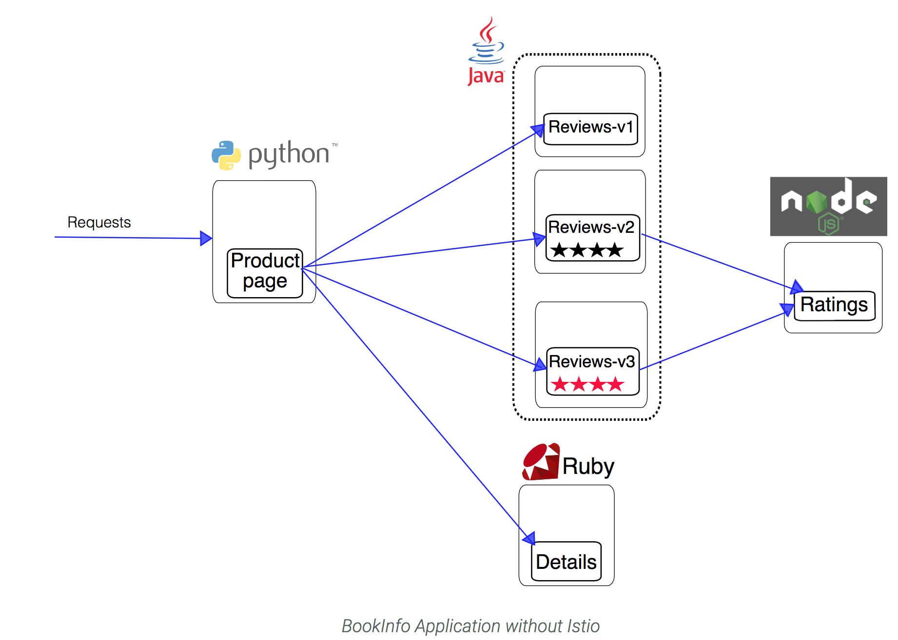

## Summary 
In this lab, you will learn how to install and configure Istio, an open source framework for connecting, securing, and managing microservices, on Kubernetes. You will also deploy an Istio-enabled multi-service application.

# Table of Contents
1. [Introduction](#introduction)
2. [Installing Istio](#installing-istio)
3. [Verifying the installation](#verifying-the-installation)
4. [Deploying an application](#deploying-an-application)
5. [Use the application](#use-the-application)

## Introduction <a name="introduction"/>

[Istio](http://istio.io) is an open source framework for connecting, securing, and managing microservices, including services running Kubernetes. It lets you create a network of deployed services with load balancing, service-to-service authentication, monitoring, and more, without requiring any changes in service code.

You add Istio support to services by deploying a special Envoy sidecar proxy to each of your application&#39;s pods in your environment that intercepts all network communication between microservices, configured and managed using Istio's control plane functionality.

## Installing Istio <a name="installing-istio"/>

Now, let&#39;s install Istio. Istio is installed in its own Kubernetes istio-system namespace, and can manage microservices from all other namespaces. The installation includes Istio core components, tools, and samples.

The [Istio release page](https://github.com/istio/istio/releases) offers download artifacts for several OSs. In our case we&#39;ll be using this command to download and extract the latest release automatically:

```curl -L https://istio.io/downloadIstio | sh -```

The installation directory contains the following:

- Installation .yaml files for Kubernetes in **install/**
- Sample applications in **samples/**
- The istioctl client binary in the **bin/** directory. This tool is used when manually injecting Envoy as a sidecar proxy and for creating routing rules and policies.
- The VERSION configuration file

Change to the istio install directory:

```cd ./istio-* ```

Add the istioctl client to your PATH:

```export PATH=$PWD/bin:$PATH```

Let&#39;s now install Istio&#39;s core components. 


Istio recently simplified the installation method by using installation profiles. The following installs the `demo` profile using `istioctl`

```
istioctl install --set profile=demo \
--set values.global.proxy.privileged=true -y
```


This creates the istio-system namespace along with the required RBAC permissions, and deploys the Istio components.

## Verifying the installation <a name="verifying-the-installation"/>

First, ensure the following Kubernetes services are deployed: istiod, istio-ingress, and istio-egress.

Run the command:
```
kubectl get svc -n istio-system
```
OUTPUT:

```
NAME            CLUSTER-IP      EXTERNAL-IP       PORT(S)                       AGE
istiod                   ClusterIP      10.35.253.85    <none>           15010/TCP,15012/TCP,443/TCP,15014/TCP                                                     8d
istio-egressgateway        ClusterIP      10.35.255.153   <none>           80/TCP,443/TCP                                                        8d
istio-ingressgateway       LoadBalancer   10.35.240.252   localhost        80:31380/TCP,443:31390/TCP,31400:31400/TCP                            8d
```

Then make sure that the corresponding Kubernetes pods are deployed and all containers are up and running.

Run the command:
```
kubectl get pods -n istio-system
```
OUTPUT:
```
NAME                                       READY     STATUS      RESTARTS   AGE
istio-egressgateway-78dd788b6d-xsmkw       1/1       Running     1          1d
istio-ingressgateway-7dd84b68d6-v2fkj      1/1       Running     1          1d
istiod-694d48c969-s5xjn                    1/1       Running     0          1d
```


## Deploying an application <a name="deploying-an-application"/>

Now Istio is installed and verified, you can deploy one of the sample applications provided with the installation — [BookInfo](https://istio.io/docs/guides/bookinfo.html). This is a simple mock bookstore application made up of four services that provide a web product page, book details, reviews (with several versions of the review service), and ratings - all managed using Istio.

You will find the source code and all the other files used in this example in your Istio [samples/bookinfo](https://github.com/istio/istio/tree/master/samples/bookinfo) directory. These steps will deploy the BookInfo application&#39;s services in an Istio-enabled environment, with Envoy sidecar proxies injected alongside each service to provide Istio functionality.

### Overview
In this guide we will deploy a simple application that displays information about a book, similar to a single catalog entry of an online book store. Displayed on the page is a description of the book, book details (ISBN, number of pages, and so on), and a few book reviews.

The BookInfo application is broken into four separate microservices:

* productpage. The productpage microservice calls the details and reviews microservices to populate the page.
* details. The details microservice contains book information.
* reviews. The reviews microservice contains book reviews. It also calls the ratings microservice.
* ratings. The ratings microservice contains book ranking information that accompanies a book review.

There are 3 versions of the reviews microservice:

* Version v1 doesn’t call the ratings service.
* Version v2 calls the ratings service, and displays each rating as 1 to 5 black stars.
* Version v3 calls the ratings service, and displays each rating as 1 to 5 red stars.

The end-to-end architecture of the application is shown below.



### Deploy Bookinfo

We deploy our application directly using `kubectl create` and its regular YAML deployment file. We will inject Envoy containers into the application pods using istioctl:

```kubectl create -f <(istioctl kube-inject -f samples/bookinfo/platform/kube/bookinfo.yaml)```

Finally, confirm that the application has been deployed correctly by running the following commands:

Run the command:
```
kubectl get services
```
OUTPUT:
```
NAME                       CLUSTER-IP   EXTERNAL-IP   PORT(S)              AGE
details       ClusterIP   10.35.240.243   <none>        9080/TCP   14s
kubernetes    ClusterIP   10.35.240.1     <none>        443/TCP    14d
productpage   ClusterIP   10.35.255.218   <none>        9080/TCP   14s
ratings       ClusterIP   10.35.244.227   <none>        9080/TCP   14s
reviews       ClusterIP   10.35.252.163   <none>        9080/TCP   14s
```

Run the command:
```
kubectl get pods
```

OUTPUT:
```
NAME                                        READY     STATUS    RESTARTS   AGE
details-v1-568f787b57-ml486       2/2       Running   0          36s
productpage-v1-74cc57988f-28nxg   2/2       Running   0          36s
ratings-v1-5bb4b7c645-8xbp8       2/2       Running   0          36s
reviews-v1-5b95b546f7-cdlww       2/2       Running   0          36s
reviews-v2-5799c54cb5-ffjv4       2/2       Running   0          36s
reviews-v3-5df5bd8dfc-9ldnx       2/2       Running   0          36s
```

With Envoy sidecars injected along side each service, the architecture will look like this:


Now that the Bookinfo services are up and running, you need to make the application accessible from outside of your Kubernetes cluster, e.g., from a browser. An Istio Gateway is used for this purpose.

Define the ingress gateway for the application:
```
kubectl apply -f samples/bookinfo/networking/bookinfo-gateway.yaml
```

Confirm the gateway has been created:
```
kubectl get gateway
```

output:
```
NAME               AGE
bookinfo-gateway   32s
```

## Use the application <a name="use-the-application"/>

Now that it&#39;s deployed, let&#39;s see the BookInfo application in action.


If running on Google Kubernetes Engine run the following to determine ingress IP and port:

```
kubectl -n istio-system get service istio-ingressgateway -o jsonpath='{.status.loadBalancer.ingress[0].ip}' 
```

OUTPUT:
```
35.xxx.xxx.xxx
```

Based on this information (Address), set the GATEWAY_URL environment variable:

`export GATEWAY_URL=$(kubectl -n istio-system get service istio-ingressgateway -o jsonpath='{.status.loadBalancer.ingress[0].ip}')`


Check that the BookInfo app is running with curl:

Run the command:
```
curl -o /dev/null -s -w "%{http_code}\n" http://${GATEWAY_URL}/productpage
```
OUTPUT:
```
200
```

Then point your browser to _**http://$GATEWAY\_URL/productpage**_ to view the BookInfo web page. If you refresh the page several times, you should see different versions of reviews shown in the product page, presented in a round robin style (red stars, black stars, no stars), since we haven&#39;t yet used Istio to control the version routing

